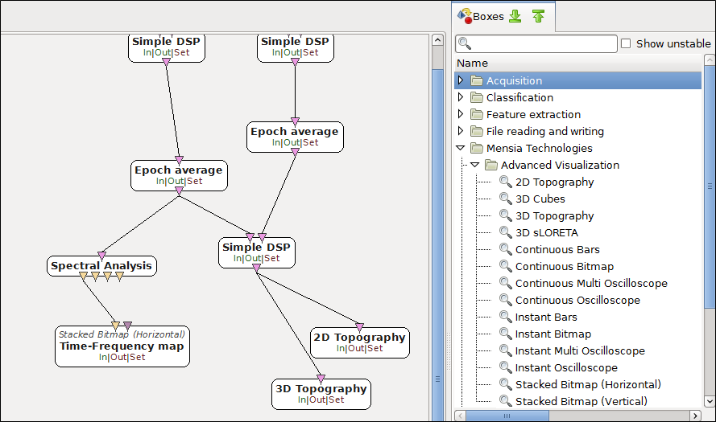
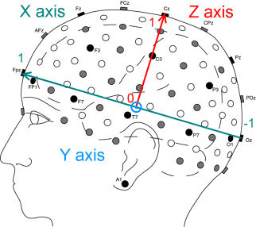
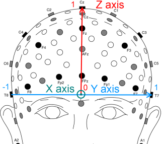

.. _Doc_Mensia_AdvViz_Concepts:
  
Concepts
========

.. _Doc_Mensia_AdvViz_Concepts_Intro:

Introduction
------------

The **Mensia Advanced Visualization Toolset** is a collection of boxes
dedicated to the visualization of the result of electrophysiological signal
analysis, and are especially suitable for the **real-time analysis of EEG
signals**, from raw signal display to 3D source reconstruction.
  
It addresses many different use-cases among users. Neurophysiologists can
observe accurately in real-time **spatial and temporal patterns** in the brain
activity (motor activity, cognitive processes). EEG signal processing
specialists can **evaluate and compare** instantly algorithms effects
(source separation, denoising techniques). BCI researchers can study how their
ERP-based system may be tuned to elicit and detect the best brain response.
  
  

   Simple integration in the graphical user interface
 
.. _Doc_Mensia_AdvViz_Concepts_VisualizationParadigms:

Visualization paradigms
-----------------------

This Toolset has been designed to be very versatile. The main design concept
revolves around the data presentation. You basically want to display matrices
of numbers which may have temporal, and/or spatial meanings. The most adapted
data presentation may vary from one case to another, according to the type of
events or patterns on which you need to get a good contrast.
  
Before choosing the right visualization box, ask yourself:

- How do I want my data to be displayed? curves? levels?
- What will be the best way to **enhance the contrast** between the information I want to extract and the rest of the data ?
- Is my data stream **continuous** in time? or am I dealing with discontinuous epochs (e.g. ERPs) ?
  
To be adapted in most situation, the Mensia Advanced Visualization Toolset has
been designed to cover different visualization paradigms. Take a look at all
the possibilities and choose what will best fit your needs.

- :ref:`Doc_Mensia_AdvViz_Concepts_VisualizationParadigms_Oscilloscope`
- :ref:`Doc_Mensia_AdvViz_Concepts_VisualizationParadigms_Bars`
- :ref:`Doc_Mensia_AdvViz_Concepts_VisualizationParadigms_Bitmap`
- :ref:`Doc_Mensia_AdvViz_Concepts_VisualizationParadigms_Topo`
- :ref:`Doc_Mensia_AdvViz_Concepts_VisualizationParadigms_Reco`
  
You can also have a look at the :ref:`Doc_Mensia_AdvViz_UseCases` "list of use-cases", showing how each box can be used on concrete, real-life examples.
  
.. _Doc_Mensia_AdvViz_Concepts_VisualizationParadigms_Oscilloscope:

The Oscilloscope view
~~~~~~~~~~~~~~~~~~~~~

It is the most basic paradigm, used to display temporal numerical data in the
form of **curves** (dots linked by lines). The Oscilloscope views are all
expecting **centered** values (i.e. distributed around 0). Hence it is advised
to use at least one temporal filter (e.g. band passing between 2 and 40 Hz
using a :ref:`Doc_BoxAlgorithm_TemporalFilter` box) before displaying an EEG
signal.
  
Four boxes use this paradigm:

- :ref:`Doc_BoxAlgorithm_ContinuousOscilloscope` box: displays continuous data from left to right on a defined horizontal scale (goes back to origin upon reaching the end of the scale), channels are displayed vertically one after another, but spikes may overlap. 
- :ref:`Doc_BoxAlgorithm_InstantOscilloscope` box: displays each block of data received as it comes, filling all the horizontal space available.
- :ref:`Doc_BoxAlgorithm_ContinuousMultiOscilloscope` box: same as the Continuous Oscilloscope, but every input channels are displayed along the same horizontal axis with a different color, additively.
- :ref:`Doc_BoxAlgorithm_InstantMultiOscilloscope` box: same as the Instant Oscilloscope, but every input channels are displayed along the same horizontal axis with a different color, additively.
   
**Example**: raw EEG signal display.

.. figure:: /boxes/images/ContinuousOscilloscope_Display.png
   :align: center

   Continuous Oscilloscope displaying 2 EEG channels  

.. _Doc_Mensia_AdvViz_Concepts_VisualizationParadigms_Bars:

The Bar view
~~~~~~~~~~~~

Like histograms, this paradigm can be used to display and compare **series of
levels**. Levels are displayed one after another from left to right, within a
**color gradient**. Channels are displayed vertically, one after another with a
fixed interval (thus some "high" levels may overlap). With a high definition
(i.e. a rather high frequency display), the result can be viewed as a curve
colored below the line.
  
Two boxes uses this paradigm:

- :ref:`Doc_BoxAlgorithm_ContinuousBars` box: displays continuous data from left to right on a defined horizontal scale (goes back to origin upon reaching the end of the scale).
- :ref:`Doc_BoxAlgorithm_InstantBars` box: displays each block of data received as it comes, filling all the horizontal space.
   
**Example**: spectrum display.

.. figure:: /boxes/images/InstantBars_Display.png
   :align: center

   Instant Bars displaying the signal spectrum
   
.. _Doc_Mensia_AdvViz_Concepts_VisualizationParadigms_Bitmap:

The Bitmap view
~~~~~~~~~~~~~~~

The bitmap paradigm displays matrices of data using a color gradient. The
result is a **2D map where each cell is given a color "bit"** .  This view
using colors can enhance easily the constrast between 2 temporal or spatial
patterns, as the difference between "cold" and "hot" colors is quickly caught
by the analyst's eye.  You can even add an additional dimension by using
**stacked bitmaps** : every time a new bitmap is received, it is placed on top
or left to the previous one.
  
Four boxes uses this paradigm:

- :ref:`Doc_BoxAlgorithm_ContinuousBitmap` box: displays continuous data from left to right on a defined  horizontal scale (goes back to origin upon reaching the end of the scale).
- :ref:`Doc_BoxAlgorithm_InstantBitmap` box: displays each block of data received as it comes, filling all the horizontal space.
- :ref:`Doc_BoxAlgorithm_StackedBitmapVertical` box: each bitmap is placed on **top** of the previous one.
- :ref:`Doc_BoxAlgorithm_StackedBitmapHorizontal` box: each bitmap is placed **left** to the previous one.
  
**Example**: Time-frequency map.

.. figure:: /boxes/images/StackedBitmapHorz_Display.png 
   :align: center

   Stacked Bitmap (Horizontal) displaying the result of a Time-Frequency analysis
   
.. _Doc_Mensia_AdvViz_Concepts_VisualizationParadigms_Topo:

The Topographic view
~~~~~~~~~~~~~~~~~~~~

This paradigm adds a strong spatial constraint on the input data: each channel
must be **labelled with an electrode name** in a defined nomenclature, such as
the standard 10-20 system. Please see
:ref:`Doc_Mensia_AdvViz_Concepts_ChannelLocalization` for further details.
  
Here again the data itself is displayed using a color gradient, mapped to a 2D or 3D model using **spherical spline interpolation**.

For more details about the spherical spline interpolation, please check *F.
Perrin, J. Pernier, O. Bertrand, J.F. Echallier, Spherical splines for scalp
potential and current density mapping, Electroencephalography and Clinical
Neurophysiology, Volume 72, Issue 2, February 1989, Pages 184-187*.  The 2D
model is a planar projection of the scalp, covering the scalp roughly from the
frontal area to the occipital area (i.e. from Fp1-Fp2 to O9-O10 sites).  The
projection result takes the shape of a disk with a crescent growth at the back
for the occipital region.
   
Three boxes uses this paradigm:

- :ref:`Doc_BoxAlgorithm_2DTopography` box: maps the input (which channels are labelled in the 10-20 system standard) to a planar projection of the scalp.
- :ref:`Doc_BoxAlgorithm_3DTopography` box: maps the input (which channels are labelled in the 10-20 system standard) to a projection on a 3D model of the scalp.
- :ref:`Doc_BoxAlgorithm_3DCubes` box: an alternative view where each channel is represented by a 3D cube, positionned in space as the electrode would be on the 3D model. 

The activity is rendered by changing the size and color of the cubes.
  
**Example**: Displaying the power of a specific frequency band on a 3D head model.

.. figure:: /boxes/images/3DTopography_Display.png
   :align: center

   Alpha power mapped on a head model using the 3D topography

.. _Doc_Mensia_AdvViz_Concepts_VisualizationParadigms_Reco:

The Reconstruction view
~~~~~~~~~~~~~~~~~~~~~~~

Tomographic reconstruction algorithms offer an inside look, into the brain,
from only surface measurements.  Several techniques exist, including the
algorithms of the popular LORETA family which slice the brain in a stack of
little cubes called voxels, and computes the *inverse model*, a model
reconstructing the sources of the potentials acquired at the measurement site.
   
One box implements the source reconstruction view:

- :ref:`Doc_BoxAlgorithm_3DTomographicVisualization` box : displays a 3D source reconstruction using 2394 colored/translucent voxels in a 3D head model. 

This box expects 2394 input channels, produced by an inverse model (i.e. a spatial filter with N sensor inputs for 2394 sources outputs). This model must be tailor-made for the precise EEG setup being used (e.g. using sLORETA).
  
.. figure:: /boxes/images/3DTomographicVisualization_Display.png
   :align: center

   3D tomographic reconstruction using the 3D Tomographic Visualization box

.. _Doc_Mensia_AdvViz_Concepts_ChannelLocalization:

Channel localization
~~~~~~~~~~~~~~~~~~~~

Every visualization box can use the spatial information conveyed by the
electrode naming. The channels can be positionned relatively to each other as
long as you provide in the box settings a file containing the cartesian
coordinates of the electrodes.  Most of the time, EEG manufacturers use the
10-20 system as an electrode naming standard. For convenience, we provide
within the Toolset a file compiling all the coordinates of the electrodes in
the 10-20 system.
  
The cartesian coordinates of all the electrodes are computed in the 3D space, where the origin is at the center of [Fpz,Oz] and [T7,T8].

- the X axis goes from the occipital lobe to the frontal lobe
- the Y axis goes from the right temporal lobe to the left temporal lobe
- the Z axis goes from the center of the head to the top
  
And as for the unit, here are some key points at the maximum of the axis:

- Fpz (1,0,0)
- Oz (-1,0,0)
- T7 (0,1,0)
- T8 (0,-1,0)
- Cz (0,0,1)
  
The following figures illustrates the cartesian coordinates of the extended 10-20 system used in the Mensia Advanced Visualization Toolset.

   Cartesian coordinates of the 10-20 system, side view.

   Cartesian coordinates of the 10-20 system, front view.
 
For more information, please see *Oostenveld, R. & Praamstra, P. (2001). The
five percent electrode system for high-resolution EEG and ERP measurements.
Clinical Neurophysiology, 112:713-719*
  
Please note that using the 10-20 system is not mandatory. To use all the Toolset features related to the spatial disposition of the electrodes, you just need to provide a file that maps electrode name with their coordinates in the space described above.
  
The format of this file is simple text. You must provide:

- the electrode names as a list of quoted labels
- the coordinate system labels
- the electrode coordinates of the electrodes, in the same order as in the electrode names
  
For example:

.. code::

    [
     	["O1" "O2" ... ]
     	["x" "y" "z" ]
    ]
    [
    	[-0.309017 -0.951057 4.48966e-011 ]
    ]
    [
    	[0.309017 -0.951057 4.48966e-011 ]
    ]
  
For a complete example, please look at the file provided with the Toolset (``../share/mensia/openvibe-plugins/cartesian.txt``)

