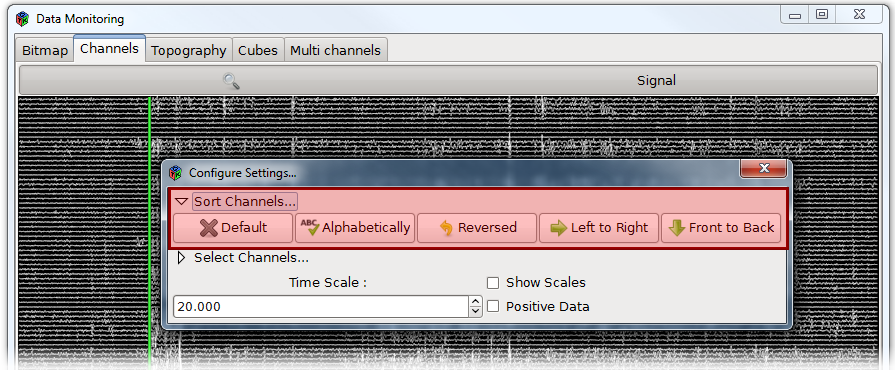
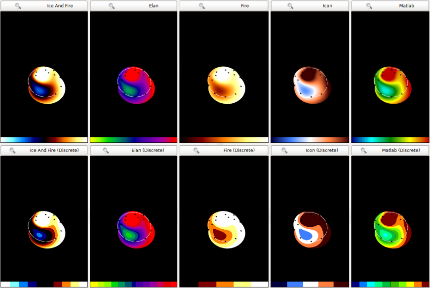
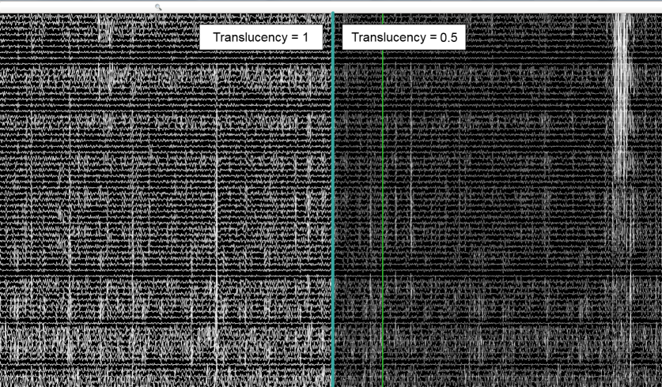
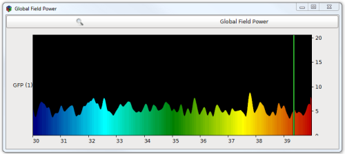
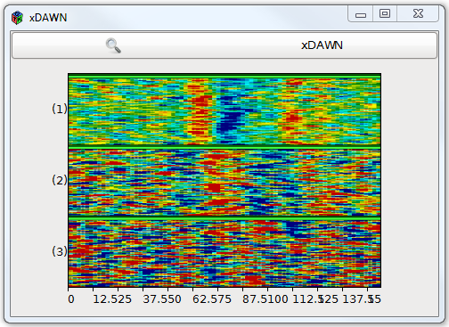
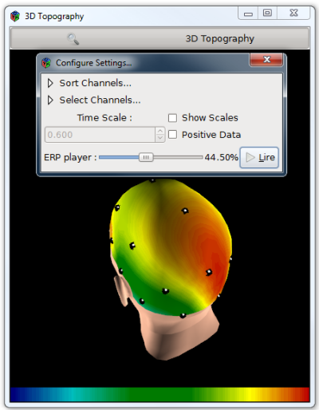

.. _Doc_Mensia_AdvViz_Configuration:

Configuration
=============

By design, all the boxes included in the Mensia Advanced Visualization Toolset
share a common behavior when it comes to configuring the boxes, in the scenario
edition or during its execution.  In this section we describe the common
configuration parameters you find when using these boxes.
  
.. _Doc_Mensia_AdvViz_Configuration_BoxSettings:

Box settings
------------

You may encounter different settings, common to all or a subset of boxes,
depending on the paradigms.

.. _Doc_Mensia_AdvViz_Configuration_ChannelLocalization:

Channel localisation
~~~~~~~~~~~~~~~~~~~~

Specify here where to find the file listing the coordinates of every electrodes
by their names. Please see
:ref:`Doc_Mensia_AdvViz_Concepts_ChannelLocalization` for more details.

For conveniency, we provide a default file
``${AdvancedViz_ChannelLocalisation}``
(*../share/mensia/openvibe-plugins/cartesian.txt*) which contains the cartesian
coordinates of all electrodes in the extended 10-20 system.  This settings is
obviously **mandatory for the Topographic views**, but can also be useful for
the other paradigms: at runtime, you can re-arrange the channels spatially by
their names (from left to right hemisphere, or from front to top).  This is
useful when dealing with dense EEG (128 or more channels), which can bring a
new light, new contrast on a rather opaque data display.

   Spatial reorganization on a dense signal display using a Continuous Oscillator

.. _Doc_Mensia_AdvViz_Configuration_Caption:

Caption
~~~~~~~

If this field is used, this label will be displayed in the window, on top of the rendering area.

.. _Doc_Mensia_AdvViz_Configuration_Color:

Color
~~~~~

The color gradient you want to use to display the data. You can use the color picker to chose the gradient manually, or use one of the presets.
  
Several presets exist in form of configuration tokens ``${AdvancedViz_ColorGradient_X}``, where X can be:

- ``Matlab`` or ``Matlab_Discrete`` (as in `Matlab <http://www.mathworks.fr/products/matlab/>`_ / `BCILAB toolbox <http://sccn.ucsd.edu/wiki/BCILAB>`_)
- ``Icon`` or ``Icon_Discrete`` (as in `ICoN <https://sites.google.com/site/marcocongedo/software/icon>`)
- ``Elan`` or ``Elan_Discrete`` (as in `Elan <http://elan.lyon.inserm.fr/>`_)
- ``Fire`` or ``Fire_Discrete``
- ``IceAndFire`` or ``IceAndFire_Discrete``

 The default values ``AdvancedViz_DefaultColorGradient`` or ``AdvancedViz_DefaultColorGradient_Discrete`` are equal to ``Matlab`` and ``Matlab_Discrete``.

Here is an example of 2D topography rendering using these color gradients:

   The color gradient presets available, illustrated with the 2D topography

.. _Doc_Mensia_AdvViz_Configuration_BoxSettings_Translucency:

Translucency
~~~~~~~~~~~~

This setting expects a value between 0 and 1, where 0 is complete transparency and 1 complete opacity.

The translucency parameter is very useful when dealing with overlapping rendering, i.e. when some parts of the visualizations end up on each other.
By adding some translucency the data can still be visible, and it can also smoothen dense readings for more confort.

   Using the translucency to allow dense yet smooth EEG reading

.. _Doc_Mensia_AdvViz_Configuration_BoxSettings_PositiveData:

Positive data only
~~~~~~~~~~~~~~~~~~

By ticking this checkbox, you shift the vertical scale of the visualization in order to have the 0 at the bottom (no negative values will be displayed)

This setting can be activated when dealing with spectral amplitude or any kind of positive-only "levels".

   Displaying a positive level (Global Field Power) using Continuous Bars

.. _Doc_Mensia_AdvViz_Configuration_BoxSettings_Gain:

Gain
~~~~

If set, all samples in the input stream are multiplied by this scalar value before display.
This can be useful when you need to display all at once different type of data on the same relative scale, with a good contrast on every view.

.. _Doc_Mensia_AdvViz_Configuration_BoxSettings_TemporalCoherence:

Temporal Coherence 
~~~~~~~~~~~~~~~~~~

Tells the box whether the input stream is expected to be **Time-locked** or
**Independent**.  In the first case the box should use a Time scale (in
seconds, for **continuous** data), and for the second case a Matrix count
(number of data block received, for **discontinuous** data).
 
.. _Doc_Mensia_AdvViz_Configuration_BoxSettings_TimeScale:

Time scale
~~~~~~~~~~

The time scale (in seconds) drives the number of values to be displayed in
continuous or stacked views before going back to the origin.  Using a time
scale is meaningful only when dealing with an input stream made of continuous
epochs, e.g. signal display, time-frequency analysis.

.. _ Doc_Mensia_AdvViz_Configuration_BoxSettings_MatrixCount:

Matrix count
~~~~~~~~~~~~

The number of input epochs to display before going back to the origin. For
example in stacked bitmaps this setting is the number of bitmaps to be stacked
before going back to the bottom of the stack.

An illustration for this setting would be the visualization of Event-Related
Potentials such as P300.  In such scenario, we usually select epochs of data
uncontinuously, e.g. by extracting 600ms of signal around a target stimulation.
Setting the Temporal coherence parameter to *Independent* will make the
box display every epochs one after another, without trying to use the epoch
timings.  For example, set to *Independent* when you want to stack P300
target trials on a bitmap view, with a matrix count equal to the number of
trials you want to stack.

   Using a Stacked Bitmap (Vertical) to display the 3 first xDAWN components of all 99 Target trials of a P300 session

.. _Doc_Mensia_AdvViz_Configuration_RuntimeToolbar:

Runtime Settings
----------------

This section covers the different settings available at runtime (i.e. when the
scenario is currently beeing played).  Clicking on the **toolbar** will open-up
the runtime visualization settings. 

- **Sort Channels** : rearrange the channels **by their name** (alphabetically
  or reversed order), or **by their position on the scalp** (left to right or
  front to back).  This last option is possible only if the channel are named
  according to the 10-20 system, and if you provided a channel localisation
  file in the box settings.

- **Select Channels** : Select in a list the channels you want to see in the
  visualization window.  Use the ``Ctrl`` or ``Shift`` key to add channels to
  your selection, ``Ctrl+a`` to select all channels.

- **Show scales** : show or hide all the scales around the visualization
  widget; allows nice snapshots.  This setting is **global**, meaning that it
  affects all the other advanced visualization windows currently running in
  your scenario.  Doing so preserves the widgets alignment when displaying
  synchronized data.  This setting can be turned on or off also by a **double
  left-click** in the visualization windows itself.

- **Positive data** : this setting is a runtime duplicate of the box setting
  *Positive data only*.  If checked, the vertical axis is shifted so
  that 0 is at the bottom. Negative values wont be displayed.

Depending on the temporal coherence selected in the box settings, you may find:

- **Time scale** : this setting is a runtime duplicate of the box setting *Time scale*.

- **Matrix count** : this setting is a runtime duplicate of the box setting *Matrix count*.

When the visualization box implements an **Instant** paradigm for **streamed
matrices or signal input** data, a new setting is available: 

- **Epoch replay** : replays the last epoch received.

Topographies also expose the ERP replay in adequat conditions.  This feature is
**global**, meaning that the replay is performed simultaneously on every
compatible boxes.  This allows for example on-demand replays of ERPs,
simultaneously on a signal display and a topography.

   Using the ERP replay feature on a 3D topography to catch the spatial course of the potential

.. _Doc_Mensia_AdvViz_Configuration_RuntimeControls:

Runtime Controls
----------------

All the visualization boxes share common controls at runtime, for a user-friendly, natural interaction.
Using the mouse, one can:

- Maintain **right click** and move the mouse up or down to **zoom in or out on the data scale**
- Maintain **left click** and move the mouse to **rotate** a 3D model
- Maintain **middle click** and move the mouse to **zoom in or out on a 3D model**
- **Double left click** in the vizualisation window to remove all the scales from the frame

All these controls are **global** , meaning that if you change the scale in one visualization window, it will change the scale in every visualization windows accordingly.
  
