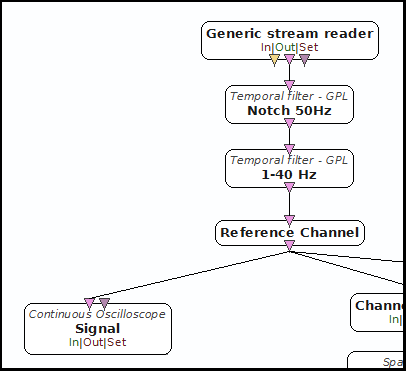
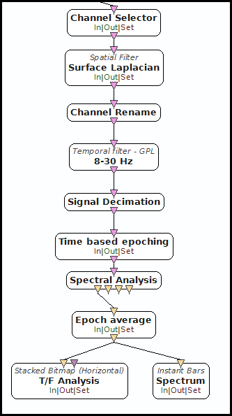
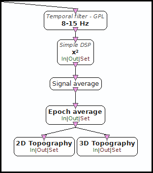
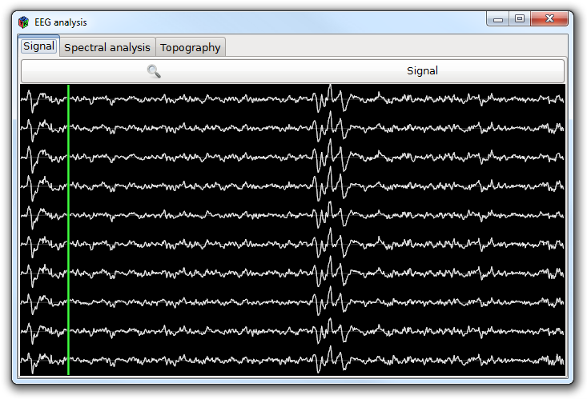
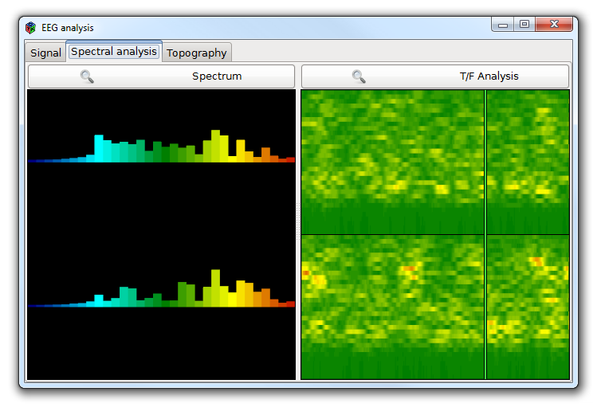
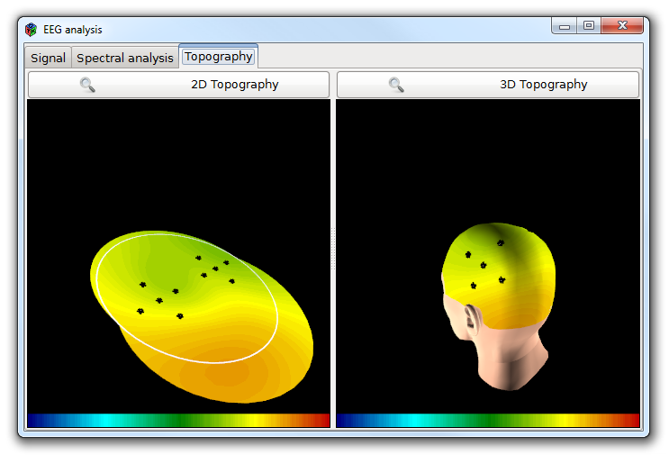

.. _Doc_Mensia_AdvViz_UseCases:

Use-cases
=========

We describe in this section of the documentation several use-cases, typical and
concrete examples of EEG analysis that are enlighted by the **Mensia Advanced
Visualization Toolset**.
  
.. _Doc_Mensia_AdvViz_UseCases_SignalAnalysis:

EEG Signal analysis
-------------------

This detailed example uses the basic OpenViBE signal processing boxes to
perform elementary real-time analysis, and the Mensia Advanced Visualization
Toolset to display the results:

- Raw and filtered EEG
- Spectrum, time-frequency map
- 2D and 3D topographies

You can find this scenario in the provided sample set, the scenario file name
is ``UseCase-1-EEG-signal-analysis.mxs``.

.. _Doc_Mensia_AdvViz_UseCases_SignalAnalysis_Intro:

Introduction
~~~~~~~~~~~~

This use-case is a simple yet concrete example of real-time EEG analysis
usually performed with OpenViBE. The scenario covers the use of oscilloscope,
bitmaps, bars and topographic views to display signal, spectrum, and band
power.

.. _Doc_Mensia_AdvViz_UseCases_SignalAnalysis_Scenario:

The scenario
~~~~~~~~~~~~

The signal used is a **motor imagery** session, where the participant performed
right and left hand motor imagery trials.  For more details, please refer to
the official documentation of the OpenViBE motor-imagery bci scenarios,
provided with the official release of the software.  We chose these data for
demonstration purpose only as it is a file provided with the official release
of openvibe, and should be available for you anyway.
  
.. _Doc_Mensia_AdvViz_UseCases_SignalAnalysis_Scenario_Filtering:

Signal filtering
^^^^^^^^^^^^^^^^

We first remove artifacts using temporal filters, especially the common 50Hz
noise coming from the electrical installation.  The EEG amplifier used for the
record we read here is a Mindmedia NeXuS 32b, with one reference channel put on
Nz (nose). The *Reference Channel* box applies this spatial filter to further
remove noises.

We then use a :ref:`Doc_BoxAlgorithm_ContinuousOscilloscope` to display the
filtered signal.

   Denoising the signal before display

.. _Doc_Mensia_AdvViz_UseCases_SignalAnalysis_Scenario_Spectrum:

Spectral analysis
^^^^^^^^^^^^^^^^^

A first pipeline computes two surface Laplacian filters around C3 and C4, the
center of the two motor cortices.  We then compute the spectrum using FFT, up
to 32 Hz, and display it using :ref:`Doc_BoxAlgorithm_InstantBars` (spectrum
levels) and :ref:`Doc_BoxAlgorithm_StackedBitmapHorizontal` (time-frequency
map).  

   Spectral analysis over filtered data

.. _Doc_Mensia_AdvViz_UseCases_SignalAnalysis_Scenario_Topo:

Topographic display
^^^^^^^^^^^^^^^^^^^

We compute in a parallel pipeline the alpha band power, averaged over several
epochs, and visualize it over the scalp through
:ref:`Doc_BoxAlgorithm_2DTopography` and :ref:`Doc_BoxAlgorithm_3DTopography`.

   Topographic display of the alpha band power over the scalp

.. _Doc_Mensia_AdvViz_UseCases_SignalAnalysis_Result:

Result
~~~~~~

Here is the online visualization when we play this scenario on the provided
data.

   Signal display

   Spectrum visualization

   2D and 3D Topographies

.. _Doc_Mensia_AdvViz_UseCases_ERPAnalysis:

Event-Related Potentials analysis
---------------------------------

This use-case is focused on the ERP extraction and visualization, applied to
P300 speller data.  The Mensia Advanced Visualization boxes allows concurrent
and comparative displays (e.g. target versus non-target potentials), and
synchronized replay capabilities

You can find this scenario in the provided sample set, the scenario file name
is ``UseCase-2-ERP-analysis.mxs``.

