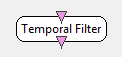

.. _Doc_BoxAlgorithm_TemporalFilter:

Temporal Filter
===============

.. container:: attribution

   :Author:
     Yann Renard & Laurent Bonnet 
   :Company:
     Mensia Technologies SA

Applies a temporal filter, based on various one-way IIR filter designs, to the input stream.

This plugin is used to filter the input signal. This plugin allows the selection of the kinf of filter (Butterworth, Chebychev, Yule-Walker),
the kind of filter (low-pass, high-pass, band-pass, band-stop), the low or/and the high edge of the filter, and the passband ripple for the Chebychev filter.

Inputs
------

.. csv-table::
   :header: "Input Name", "Stream Type"

   "Input signal", "Signal"

Input signal
~~~~~~~~~~~~

The input signal.

Outputs
-------

.. csv-table::
   :header: "Output Name", "Stream Type"

   "Output signal", "Signal"

Output signal
~~~~~~~~~~~~~

The filtered signal.

.. _Doc_BoxAlgorithm_TemporalFilter_Settings:

Settings
--------

.. csv-table::
   :header: "Setting Name", "Type", "Default Value"

   "Filter Method", "Filter method", "Butterworth"
   "Filter Type", "Filter type", "Band Pass"
   "Filter Order", "Integer", "4"
   "Low Cut-off Frequency (Hz)", "Float", "1"
   "High Cut-off Frequency (Hz)", "Float", "40"
   "Band Pass Ripple (dB)", "Float", "0.5"

Filter Method
~~~~~~~~~~~~~

Select the name of filter between Butterworth, Chebychev and Yule-Walker.

Filter Type
~~~~~~~~~~~

Select the kind of filter between low-pass, high-pass, band-pass, band-stop.

Filter Order
~~~~~~~~~~~~

Order :math:`n` of the filter, with :math:`n \geq 1`.

Low Cut-off Frequency (Hz)
~~~~~~~~~~~~~~~~~~~~~~~~~~

Low cut-off frequency  :math:`f_1 > 0` for high-pass, band-pass and band-stop filters (not used with low-pass filter).
Low cut-off frequency can not be above Nyquist-Shannon criteria (half of the sampling rate).

High Cut-off Frequency (Hz)
~~~~~~~~~~~~~~~~~~~~~~~~~~~

High cut-off frequency  :math:`f_2 > 0` for low-pass, band-pass and band-stop filters (not used with high-pass filter). For band-pass and band-stop filters, :math:`f_1 < f_2`.
High cut-off frequency can not be above Nyquist-Shannon criteria (half of the sampling rate).

Band Pass Ripple (dB)
~~~~~~~~~~~~~~~~~~~~~

If Chebychev filter is selected, pass band ripple in dB is a necessary information.

.. _Doc_BoxAlgorithm_TemporalFilter_Examples:

Examples
--------

Let's consider our input signal is very noisy (50 Hz).
To filter this signal, select a Low pass Butterworth filter of 4th order and High Edge equal to 30 Hz for example.

